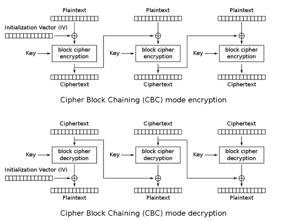
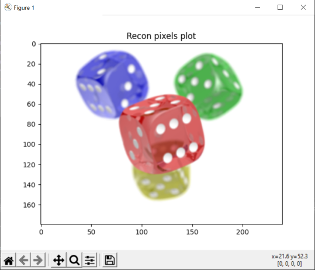
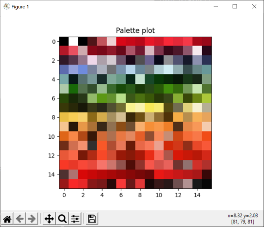
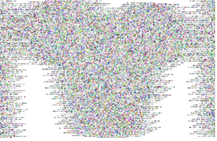
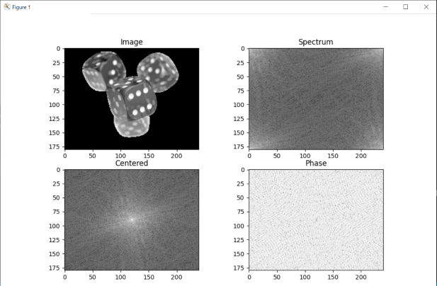

# E-media

The project was made for an E-media course on the studies of Control Engineering and Robotics on specialization Information Technologies in Control Engineering at the Wrocław University of Science and Technology.
The project consists of 2 parts:

- png image parser
- data cryptography

---
## Requirements

- matplotlib
- tkinter
- tabulate
- PyCryptodome

## PNG Chunks

| Length  | Chunk type |  Chunk data  |   CRC   |
|---------|------------|--------------|---------|
| 4 bytes | 4 bytes    | Length bytes | 4 bytes |

## All Critical chunks parser can decode

- **IHDR** : must be the first chunk; it contains (in this order) the image's width,
        height, bit depth, color type, compression method, filter method, and
        interlace method (13 data bytes total).

- **PLTE** : contains the palette; list of colors.

- **IDAT** : contains the image, which may be split among multiple IDAT chunks.
        Such splitting increases filesize slightly, but makes it possible to
        generate a PNG in a streaming manner. The IDAT chunk contains the
        actual image data, which is the output stream of the compression
        algorithm.

- **IEND** : marks the image end.

## Ancillary chunks, which parser can decode

- **cHRM** : gives the chromaticity coordinates of the display primaries and white
        point.

- **gAMA** : specifies gamma.

- **iTXt** : contains a keyword and UTF-8 text, with encodings for possible
        compression and translations marked with language tag. The Extensible
        Metadata Platform (XMP) uses this chunk with a keyword
        'XML:com.adobe.xmp'

- **zTXt** : contains compressed text (and a compression method marker) with the same limits as tEXt.

- **sRGB** : indicates that the standard sRGB color space is used.

- **tEXt** : can store text that can be represented in ISO/IEC 8859-1, with one
        key-value pair for each chunk. The "key" must be between 1 and 79
        characters long. Separator is a null character. The "value" can be any
        length, including zero up to the maximum permissible chunk size minus
        the length of the keyword and separator. Neither "key" nor "value" can
        contain null character. Leading or trailing spaces are also disallowed.

- **tIME** : stores the time that the image was last changed.

## RSA Algorithm

Pixels from the IDAT chunk are encrypted by the RSA algorithm. RSA (Rivest–Shamir–Adleman) is an algorithm used by modern computers to encrypt and decrypt messages. It is an asymmetric cryptographic algorithm. Asymmetric means that there are two different keys:

- **public key**

- **private key**

The public key can be known to everyone- it is used to encrypt messages. Messages encrypted using the public key can only be decrypted with the private key. Calculating the private key from the public key is very difficult.

## Block cipher

Because of big data held in IDAT chunks, we have to use the block cipher mode of operation to encrypt pixels using the RSA algorithm. In this project we use two modes:

- **ECB - Electronic Codebook**

- **CBC - Cipher Block Chaining**

### Electronic Codebook

Electronic codebook is the simplest of the encryption modes. The message is divided into blocks, and each block is encrypted separately. The disadvantage of this method is a lack of diffusion. Because ECB encrypts identical plaintext blocks into identical ciphertext blocks, it does not hide data patterns well.


### Cipher Block Chaining

In CBC mode, each block of plaintext is XORed with the previous ciphertext block before being encrypted. This way, each ciphertext block depends on all plaintext blocks processed up to that point. To make each message unique, an initialization vector must be used in the first block.



## How to run

1. In command line write:

```shell
python main.py
```

2. You will see GUI and two buttons:

- PNG with ECB
- PNG with CBC

After pressing the button, you can load the file. You can load only png files because of the blockade. First button load chosen png files, parse him, show processed chunks, encrypt using our implementation of RSA algorithm in ECB and encrypt using Crypto library in ECB and showing Fast Fourier Transform of image. Second button load chosen png files, parse him, show processed chunks, encrypt using our implementation of RSA algorithm in CBC and showing Fast Fourier Transform of image.


3. Afterload png file and chose the first button you will see processed chunks:

For example cubes.png:

```shell
[b'IHDR', b'gAMA', b'cHRM', b'bKGD', b'tIME', b'IDAT', b'IDAT', b'tEXt', b'tEXt', b'IEND']

IHDR:

Width of image 240 and height of image 180
Bit depth of image: 8
PNG Image Type: Truecolor with alpha
Compression method: 0
Filter method: 0
Interlace method: 0

IDAT:

Recon pixels are shown by matplotlib on Figure 1

Pixels are filtered and shown

PLTE chunk is optional

gAMA:

The value of decoded gamma is 0.45455

cHRM:

Table of chromaticity values:
-  ----  -----  ----  -----------
   Red   Green  Blue  White Point
x  0.64  0.3    0.15  0.3127
y  0.33  0.6    0.06  0.329
-  ----  -----  ----  -----------

tEXt:

Keyword: date:create
Data: 2020-09-26T19:16:45+00:00


tEXt:

Keyword: date:modify
Data: 2020-09-26T19:16:45+00:00


tIME:

Last modification date: 26.09.2020 19:16:45

IEND:
IEND is empty
```

Recon pixels:



If the image has PLTE(cubes.png doesn't have) chunk you will see a processed palette:



4. After processed chunks, the program encrypts pixels in two ways. Using our implementation
of RSA algorithm in ECB and using Crypto library in ECB.

5. In file ecb.png you will see encrypt image using our implementation for cubes.png:



5. In file ecb_library.png you will see encrypt image using library for cubes.png:


We can see that the Crypto library is better.

6. After encrypted pixels you will see Fast Fourier transform of the loaded image png:



## Bibliography

- https://pyokagan.name/blog/2019-10-14-png/
- http://www.libpng.org/pub/png/spec/1.2/PNG-Chunks.html
- https://github.com/Hedroed/png-parser
- https://stackoverflow.com/questions/1089662/python-inflate-and-deflate-implementations
- https://stackoverflow.com/questions/44497352/printing-one-color-using-imshow
- https://medium.com/@prudywsh/how-to-generate-big-prime-numbers-miller-rabin-49e6e6af32fb
- https://simple.wikipedia.org/wiki/RSA_algorithm
- https://en.wikipedia.org/wiki/Block_cipher_mode_of_operation

## Authors

- Adam Bednorz
- Kajetan Zdanowicz

---
